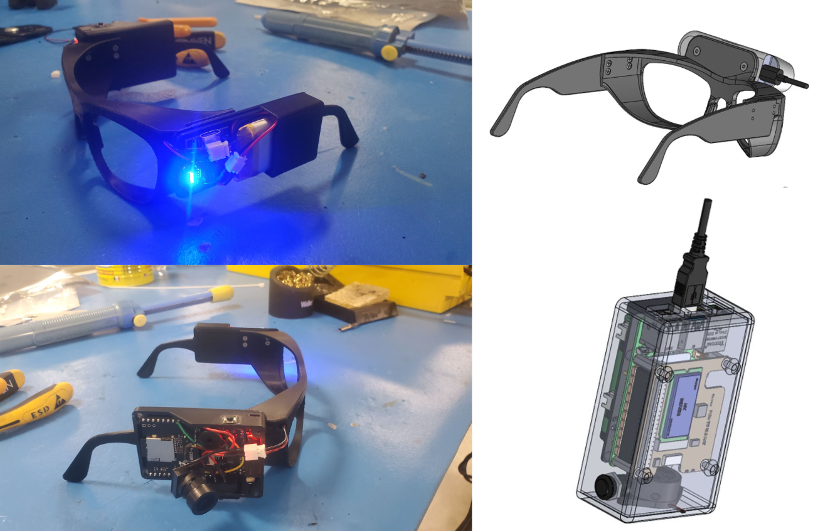

# Antoine Jamme's Personal Website
**Personal academic website showcasing my work as a Co-founder & Hardware Engineer at OMGrab.**



# About This Website

This is my personal academic website built with Jekyll and the Academic Pages template. The site showcases my work as a hardware engineer and co-founder at OMGrab, where we're building robotics-grade smartglasses for large-scale robot training data collection.

## Website Sections

- **About**: My background and current work at OMGrab
- **Portfolio**: Recent projects and hardware development work
- **CV**: Professional experience and education

## Contact

- **Email**: antoinejamme@mail.com
- **LinkedIn**: [antoine-jamme](https://www.linkedin.com/in/antoine-jamme/)
- **GitHub**: [AntoineJamme](https://github.com/AntoineJamme)

# Development

## Running locally

When working on this website, it's useful to preview changes locally before pushing to GitHub. To work locally you will need to:

1. Clone this repository and make your updates.

### Using a different IDE
1. Make sure you have ruby-dev, bundler, and nodejs installed
    
    On most Linux distribution and [Windows Subsystem Linux](https://learn.microsoft.com/en-us/windows/wsl/about) the command is:
    ```bash
    sudo apt install ruby-dev ruby-bundler nodejs
    ```
    If you see error `Unable to locate package ruby-bundler`, `Unable to locate package nodejs `, run the following:
    ```bash
    sudo apt update && sudo apt upgrade -y
    ```
    then try run `sudo apt install ruby-dev ruby-bundler nodejs` again.

    On MacOS the commands are:
    ```bash
    brew install ruby
    brew install node
    gem install bundler
    ```
1. Run `bundle install` to install ruby dependencies. If you get errors, delete Gemfile.lock and try again.

    If you see file permission error like `Fetching bundler-2.6.3.gem ERROR:  While executing gem (Gem::FilePermissionError) You don't have write permissions for the /var/lib/gems/3.2.0 directory.` or `Bundler::PermissionError: There was an error while trying to write to /usr/local/bin.`
    Install Gems Locally (Recommended):
    ```bash
    bundle config set --local path 'vendor/bundle'
    ```
    then try run `bundle install` again. If succeeded, you should see a folder called `vendor` and `.bundle`.

1. Run `jekyll serve -l -H localhost` to generate the HTML and serve it from `localhost:4000` the local server will automatically rebuild and refresh the pages on change to Markdown (*.md) and HTML files, while changes to the core template and configuration (i.e., `_config.yml`) will require stoping and restarting Jekyll.
    You may also try `bundle exec jekyll serve -l -H localhost` to ensure jekyll to use specific dependencies on your own local machine.

If you are running on Linux it may be necessary to install some additional dependencies prior to being able to run locally: `sudo apt install build-essential gcc make`

## Using Docker

Working from a different OS, or just want to avoid installing dependencies? You can use the provided `Dockerfile` to build a container that will run the site for you if you have [Docker](https://www.docker.com/) installed.

You can build and execute the container by running the following command in the repository:

```bash
chmod -R 777 .
docker compose up
```

You should now be able to access the website from `localhost:4000`.

### Using the DevContainer in VS Code

If you are using [Visual Studio Code](https://code.visualstudio.com/) you can use the [Dev Container](https://code.visualstudio.com/docs/devcontainers/containers) that comes with this Repository. Normally VS Code detects that a development coontainer configuration is available and asks you if you want to use the container. If this doesn't happen you can manually start the container by **F1->DevContainer: Reopen in Container**. This restarts your VS Code in the container and automatically hosts your academic page locally on http://localhost:4000. All changes will be updated live to that page after a few seconds.

# Credits

This website is built using the [Academic Pages](https://academicpages.github.io/) Jekyll template, which was forked from the [Minimal Mistakes Jekyll Theme](https://mmistakes.github.io/minimal-mistakes/) by Michael Rose.

## Template Information

- **Original Template**: [Academic Pages](https://github.com/academicpages/academicpages.github.io)
- **Base Theme**: [Minimal Mistakes](https://mmistakes.github.io/minimal-mistakes/) by Michael Rose
- **License**: MIT License (see LICENSE.md)

For questions about the template or to report issues, please visit the [Academic Pages repository](https://github.com/academicpages/academicpages.github.io).

---
<div align="center">
    

[](https://github.com/academicpages/academicpages.github.io/graphs/contributors)
[](https://github.com/academicpages/academicpages.github.io/releases/latest)
[](https://github.com/academicpages/academicpages.github.io/blob/master/LICENSE)

[](https://github.com/academicpages/academicpages.github.io)
[](https://github.com/academicpages/academicpages.github.io/fork)
</div>
